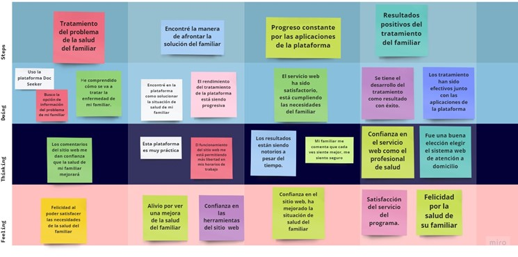
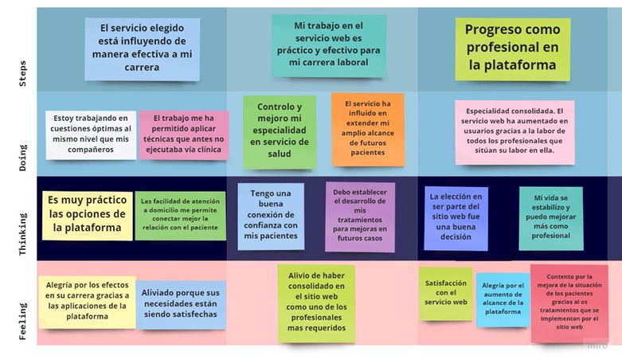
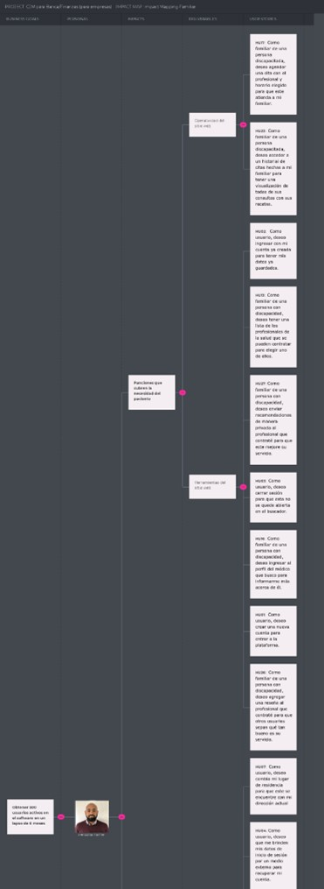
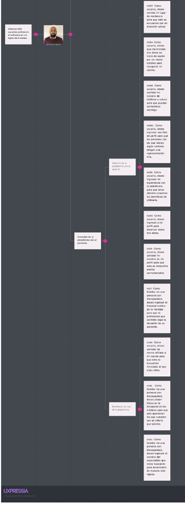
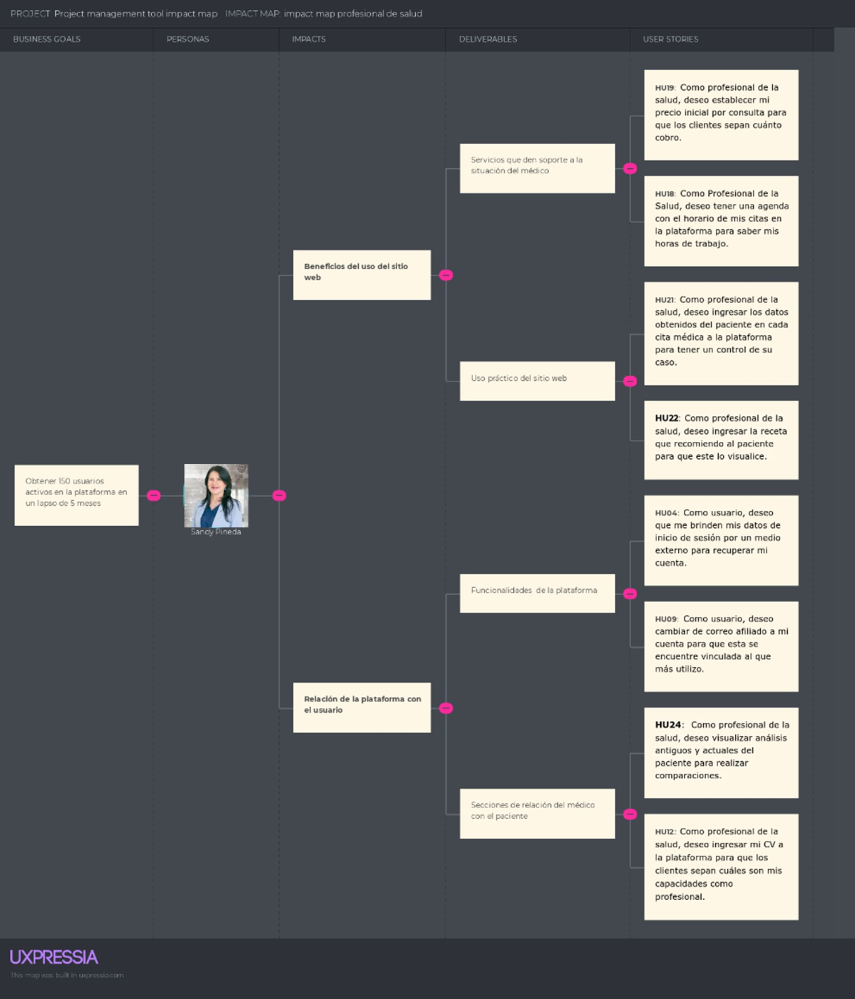

# 3. REQUIREMENTS SPECIFICATION

## 3.1. To-Be Scenario Mapping.

To be Scenary map nos permite establecer las ideas, pensamientos y necesidades del usuario. Por ello, se decidió usar esta herramienta para tener un concepto de primera persona de nuestros usuarios, y así en nuestro sitio web tener las soluciones a sus problemas y ser su principal opción en el mercado.

<figure style="text-align: center">
    <figcaption> Segmento 1: Familiar de la persona con limitación.</figcaption>
    
</figure>

Se presenta la versión del usuario, familiar de la persona con limitación, en la cual se estableció ya sus necesidades satisfechas a través de nuestro sitio web.

<figure style="text-align: center">
    <figcaption> Segmento 2: Profesional de Salud.</figcaption>
    
</figure>

Se presenta la versión del usuario, profesional de salud, en la cual se ve el avance en la satisfacción de sus necesidades, gracias al afiliarse con nuestro servicio web.

## 3.2. User Stories

Epics

| Epics ID | Título                             | Descripción                                                                                                                            | Relacionado con (Epics ID) |
| -------- | ---------------------------------- | -------------------------------------------------------------------------------------------------------------------------------------- | -------------------------- |
| EP01     | Gestión de Cuenta                  | Como usuario deseo acceder a mi cuenta privada para entrar a la plataforma.                                                            | EP01                       |
| EP02     | Gestión de Perfil                  | Como usuario, deseo realizar cambios en mi perfil para que este se encuentre actualizado.                                              | EP02                       |
| EP03     | Gestión de Contrataciones          | Como familiar de una persona con discapacidad, deseo contratar a un profesional para que atienda a mi familiar.                        | EP03                       |
| EP04     | Gestión de Pago                    | Como profesional de la salud, deseo controlar los pagos de mis servicios para que estos sean recompensados de manera justa.            | EP04                       |
| EP05     | Gestión de Resultados de Consultas | Como usuario, deseo que todos los chequeos que se realicen en el paciente sean archivados en la plataforma para tener un buen control. | EP05                       |

### User Stories

A continuación, se redactarán las historias de usuario de nuestra aplicación. Estas manifestarán las necesidades que tiene cada uno de los involucrados en la Plataforma. Es decir, se representarán los requisitos que tiene la app. Además, se mostrarán los criterios de aceptación que contendrán cada uno de los posibles escenarios que involucran a cada US. Finalmente, se mostrarán las Epics con las que están relacionados.

<table class="tg" style="undefined;table-layout: fixed; width: 685px">
<colgroup>
<col style="width: 188.2px">
<col style="width: 102.2px">
<col style="width: 75.2px">
<col style="width: 319.2px">
</colgroup>
<thead>
  <tr>
    <th class="tg-fymr">    User Story ID   </th>
    <th class="tg-0pky">HU01</th>
    <th class="tg-fymr">    Epic ID   </th>
    <th class="tg-0pky">EP01</th>
  </tr>
</thead>
<tbody>
  <tr>
    <td class="tg-fymr">    Title   </td>
    <td class="tg-c3ow" colspan="3">    Registrar Cuenta   </td>
  </tr>
  <tr>
    <td class="tg-fymr">    Description   </td>
    <td class="tg-c3ow" colspan="3">Como usuario, quiero crear una nueva cuenta para entrar a la plataforma.</td>
  </tr>
  <tr>
    <td class="tg-fymr" colspan="4">    Acceptance criteria   </td>
  </tr>
  <tr>
    <td class="tg-lboi" colspan="4">&nbsp;&nbsp;&nbsp; E01: Ingreso correcto de&nbsp;&nbsp;&nbsp;datos &nbsp;&nbsp;&nbsp; CA01: &nbsp;&nbsp;&nbsp; Dado que el usuario se encuentra en el formulario de&nbsp;&nbsp;&nbsp;registro &nbsp;&nbsp;&nbsp; Cuando ingresa su nombre, correo, ubicación, edad,&nbsp;&nbsp;&nbsp;número de celular, contraseña y apellidos correctos, y elige su rol  &nbsp;&nbsp;&nbsp; Entonces se registra su nueva cuenta &nbsp;&nbsp;&nbsp;   &nbsp;&nbsp;&nbsp; E02: Ingreso incorrecto&nbsp;&nbsp;&nbsp;de datos &nbsp;&nbsp;&nbsp; CA02: &nbsp;&nbsp;&nbsp; Dado que el usuario se encuentra en el formulario de&nbsp;&nbsp;&nbsp;registro &nbsp;&nbsp;&nbsp; Cuando ingresa su ubicación, correo, edad, número&nbsp;&nbsp;&nbsp;de celular, contraseña y apellidos correctos, y elige su rol, pero su nombre&nbsp;&nbsp;&nbsp;está con caracteres no permitidos &nbsp;&nbsp;&nbsp; Entonces sale una equis roja al lado de la casilla&nbsp;&nbsp;&nbsp;con el mensaje de nombre incorrecto &nbsp;&nbsp;&nbsp; CA03: &nbsp;&nbsp;&nbsp; Dado que el usuario se encuentra en el formulario de&nbsp;&nbsp;&nbsp;registro &nbsp;&nbsp;&nbsp; Cuando ingresa su nombre, correo, edad, número de&nbsp;&nbsp;&nbsp;celular, contraseña y apellidos correctos, y elige su rol, pero su ubicación&nbsp;&nbsp;&nbsp;está con caracteres no permitidos &nbsp;&nbsp;&nbsp; Entonces Sale una equis roja al lado de la casilla&nbsp;&nbsp;&nbsp;con el mensaje de ubicación incorrecta &nbsp;&nbsp;&nbsp; CA04: &nbsp;&nbsp;&nbsp; Dado que el usuario se encuentra en el formulario de&nbsp;&nbsp;&nbsp;registro &nbsp;&nbsp;&nbsp; Cuando ingresa su nombre, correo, ubicación,&nbsp;&nbsp;&nbsp;número de celular, contraseña y apellidos correctos, y elige su rol, pero su edad&nbsp;&nbsp;&nbsp;está con caracteres no permitidos &nbsp;&nbsp;&nbsp; Entonces Sale una equis roja al lado de la casilla&nbsp;&nbsp;&nbsp;con el mensaje de edad incorrecta &nbsp;&nbsp;&nbsp; CA05: &nbsp;&nbsp;&nbsp; Dado que el usuario se encuentra en el formulario de&nbsp;&nbsp;&nbsp;registro &nbsp;&nbsp;&nbsp; Cuando ingresa su nombre, correo, edad, número de&nbsp;&nbsp;&nbsp;celular, contraseña y ubicación correctas, y elige su rol, pero sus apellidos&nbsp;&nbsp;&nbsp;están con caracteres no permitidos &nbsp;&nbsp;&nbsp; Entonces Sale una equis roja al lado de la casilla&nbsp;&nbsp;&nbsp;con el mensaje de apellido incorrecto &nbsp;&nbsp;&nbsp; CA06: &nbsp;&nbsp;&nbsp; Dado que el usuario se encuentra en el formulario de&nbsp;&nbsp;&nbsp;registro &nbsp;&nbsp;&nbsp; Cuando ingresa su nombre, apellidos, edad, número&nbsp;&nbsp;&nbsp;de celular, contraseña y ubicación correctas, y elige su rol, pero su correo&nbsp;&nbsp;&nbsp;está con caracteres no permitidos &nbsp;&nbsp;&nbsp; Entonces Sale una equis roja al lado de la casilla&nbsp;&nbsp;&nbsp;con el mensaje de correo incorrecto &nbsp;&nbsp;&nbsp; CA07: &nbsp;&nbsp;&nbsp; Dado que el usuario se encuentra en el formulario de&nbsp;&nbsp;&nbsp;registro &nbsp;&nbsp;&nbsp; Cuando ingresa su nombre, correo, edad, número de&nbsp;&nbsp;&nbsp;celular, ubicación, contraseña y apellidos correctos, pero no elige su rol &nbsp;&nbsp;&nbsp; Entonces Sale un&nbsp;&nbsp;&nbsp;mensaje que advierte que no se ha seleccionado rol en la plataforma.&nbsp;&nbsp;&nbsp;</td>
  </tr>
</tbody>
</table>

<table class="tg" style="undefined;table-layout: fixed; width: 685px">
<colgroup>
<col style="width: 188.2px">
<col style="width: 102.2px">
<col style="width: 75.2px">
<col style="width: 319.2px">
</colgroup>
<thead>
  <tr>
    <th class="tg-fymr">    User Story ID   </th>
    <th class="tg-0pky">HU02</th>
    <th class="tg-fymr">    Epic ID   </th>
    <th class="tg-0pky">EP01</th>
  </tr>
</thead>
<tbody>
  <tr>
    <td class="tg-fymr">    Title   </td>
    <td class="tg-c3ow" colspan="3">Iniciar Sesión</td>
  </tr>
  <tr>
    <td class="tg-fymr">    Description   </td>
    <td class="tg-c3ow" colspan="3">Como usuario, quiero ingresar con mi cuenta para tener mis datos ya guardados.</td>
  </tr>
  <tr>
    <td class="tg-fymr" colspan="4">    Acceptance criteria   </td>
  </tr>
  <tr>
    <td class="tg-lboi" colspan="4">&nbsp;&nbsp;&nbsp; E01: Ingreso correcto de&nbsp;&nbsp;&nbsp;datos &nbsp;&nbsp;&nbsp; CA01: &nbsp;&nbsp;&nbsp; Dado que el usuario se encuentra en el formulario de&nbsp;&nbsp;&nbsp;inicio de sesión &nbsp;&nbsp;&nbsp; Cuando ingresa su correo y contraseña de manera&nbsp;&nbsp;&nbsp;correcta &nbsp;&nbsp;&nbsp; Entonces ingresa a la plataforma con la sesión&nbsp;&nbsp;&nbsp;iniciada &nbsp;&nbsp;&nbsp;   &nbsp;&nbsp;&nbsp; E02: Ingreso incorrecto&nbsp;&nbsp;&nbsp;de datos &nbsp;&nbsp;&nbsp; CA02: &nbsp;&nbsp;&nbsp; Dado que el usuario se encuentra en el formulario de&nbsp;&nbsp;&nbsp;inicio de sesión &nbsp;&nbsp;&nbsp; Cuando ingresa mi correo correcto, pero su&nbsp;&nbsp;&nbsp;contraseña incorrecta &nbsp;&nbsp;&nbsp; Entonces Sale un mensaje que advierte que se ingresó&nbsp;&nbsp;&nbsp;el correo o la contraseña de manera incorrecta. &nbsp;&nbsp;&nbsp; CA03: &nbsp;&nbsp;&nbsp; Dado que el usuario se encuentra en el formulario de&nbsp;&nbsp;&nbsp;inicio de sesión &nbsp;&nbsp;&nbsp; Cuando ingresa su contraseña correcta, pero su&nbsp;&nbsp;&nbsp;correo incorrecto &nbsp;&nbsp;&nbsp; Entonces Sale un mensaje que advierte que se ingresó&nbsp;&nbsp;&nbsp;el correo o la contraseña de manera incorrecta.&nbsp;&nbsp;&nbsp;</td>
  </tr>
</tbody>
</table>

<table class="tg" style="undefined;table-layout: fixed; width: 685px">
<colgroup>
<col style="width: 188.2px">
<col style="width: 102.2px">
<col style="width: 75.2px">
<col style="width: 319.2px">
</colgroup>
<thead>
  <tr>
    <th class="tg-fymr">    User Story ID   </th>
    <th class="tg-0pky">HU03</th>
    <th class="tg-fymr">    Epic ID   </th>
    <th class="tg-0pky">EP01</th>
  </tr>
</thead>
<tbody>
  <tr>
    <td class="tg-fymr">    Title   </td>
    <td class="tg-c3ow" colspan="3">Cerrar Sesión</td>
  </tr>
  <tr>
    <td class="tg-fymr">    Description   </td>
    <td class="tg-c3ow" colspan="3">Como usuario, quiero cerrar sesión para que esta no se quede abierta en el buscador.</td>
  </tr>
  <tr>
    <td class="tg-fymr" colspan="4">    Acceptance criteria   </td>
  </tr>
  <tr>
    <td class="tg-lboi" colspan="4">&nbsp;&nbsp;&nbsp; E01: No hay acciones en&nbsp;&nbsp;&nbsp;proceso &nbsp;&nbsp;&nbsp; CA01: &nbsp;&nbsp;&nbsp; Dado que el usuario se encuentra dentro de la&nbsp;&nbsp;&nbsp;plataforma &nbsp;&nbsp;&nbsp; Cuando presiona la opción de cerrar sesión y no&nbsp;&nbsp;&nbsp;tiene una contratación ni una reseña en proceso &nbsp;&nbsp;&nbsp; Entonces se cierra sesión correctamente &nbsp;&nbsp;&nbsp;   &nbsp;&nbsp;&nbsp; E02: Hay acciones en proceso &nbsp;&nbsp;&nbsp; CA02: &nbsp;&nbsp;&nbsp; Dado que el usuario se encuentra dentro de la&nbsp;&nbsp;&nbsp;plataforma &nbsp;&nbsp;&nbsp; Cuando presiona la opción de cerrar sesión y no&nbsp;&nbsp;&nbsp;tiene una contratación en proceso, pero sí una reseña &nbsp;&nbsp;&nbsp; Entonces sale un mensaje que advierte que aún hay&nbsp;&nbsp;&nbsp;acciones en proceso &nbsp;&nbsp;&nbsp; CA03 &nbsp;&nbsp;&nbsp; Dado que el usuario se encuentra dentro de la&nbsp;&nbsp;&nbsp;plataforma &nbsp;&nbsp;&nbsp; Cuando presiona la opción de cerrar sesión y no&nbsp;&nbsp;&nbsp;tiene una reseña en proceso, pero sí una contratación &nbsp;&nbsp;&nbsp; Entonces sale un mensaje que advierte que aún hay&nbsp;&nbsp;&nbsp;acciones en proceso&nbsp;&nbsp;&nbsp;</td>
  </tr>
</tbody>
</table>

<table class="tg">
<thead>
  <tr>
    <th class="tg-0pky">    User Story ID   </th>
    <th class="tg-0pky">HU04</th>
    <th class="tg-0pky">    Epic ID   </th>
    <th class="tg-0pky">EP01</th>
  </tr>
</thead>
<tbody>
  <tr>
    <td class="tg-0pky">    Title   </td>
    <td class="tg-0pky" colspan="3">Recuperar Cuenta</td>
  </tr>
  <tr>
    <td class="tg-0pky">    Description   </td>
    <td class="tg-0pky" colspan="3">Como usuario, quiero que me brinden mis datos de inicio de sesión por un medio externo para recuperar mi cuenta.</td>
  </tr>
  <tr>
    <td class="tg-0pky" colspan="4">    Acceptance criteria   </td>
  </tr>
  <tr>
    <td class="tg-lboi" colspan="4">&nbsp;&nbsp;&nbsp; E01: Ingreso correcto de&nbsp;&nbsp;&nbsp;datos &nbsp;&nbsp;&nbsp; CA01: &nbsp;&nbsp;&nbsp; Dado que el usuario se encuentra en el formulario de&nbsp;&nbsp;&nbsp;recuperar cuenta por correo electrónico &nbsp;&nbsp;&nbsp; Cuando ingresa un correo válido &nbsp;&nbsp;&nbsp; Entonces se envía la contraseña en un email &nbsp;&nbsp;&nbsp;   &nbsp;&nbsp;&nbsp; E02: Ingreso incorrecto&nbsp;&nbsp;&nbsp;de datos &nbsp;&nbsp;&nbsp; CA02: &nbsp;&nbsp;&nbsp; Dado que el usuario se encuentra en el formulario de&nbsp;&nbsp;&nbsp;recuperar cuenta por correo electrónico &nbsp;&nbsp;&nbsp; Cuando ingresa un correo no afiliado &nbsp;&nbsp;&nbsp; Entonces sale un mensaje que advierte que el correo&nbsp;&nbsp;&nbsp;no es válido&nbsp;&nbsp;&nbsp;</td>
  </tr>
</tbody>
</table>

<table class="tg">
<thead>
  <tr>
    <th class="tg-0pky">    User Story ID   </th>
    <th class="tg-0pky">HU05</th>
    <th class="tg-0pky">    Epic ID   </th>
    <th class="tg-0pky">EP02</th>
  </tr>
</thead>
<tbody>
  <tr>
    <td class="tg-0pky">    Title   </td>
    <td class="tg-0pky" colspan="3">Visualización de Perfil</td>
  </tr>
  <tr>
    <td class="tg-0pky">    Description   </td>
    <td class="tg-0pky" colspan="3">Como usuario, deseo ingresar a mi perfil para observar todos mis datos.</td>
  </tr>
  <tr>
    <td class="tg-0pky" colspan="4">    Acceptance criteria   </td>
  </tr>
  <tr>
    <td class="tg-lboi" colspan="4">&nbsp;&nbsp;&nbsp; E01: Sesión ya iniciada &nbsp;&nbsp;&nbsp; CA01: &nbsp;&nbsp;&nbsp; Dado que el usuario se encuentra dentro de la&nbsp;&nbsp;&nbsp;plataforma &nbsp;&nbsp;&nbsp; Cuando inicia sesión y presiona la opción de ver&nbsp;&nbsp;&nbsp;perfil &nbsp;&nbsp;&nbsp; Entonces se le concede acceso a su perfil&nbsp;&nbsp;&nbsp;</td>
  </tr>
</tbody>
</table>

<table class="tg">
<thead>
  <tr>
    <th class="tg-0pky">    User Story ID   </th>
    <th class="tg-0pky">HU06</th>
    <th class="tg-0pky">    Epic ID   </th>
    <th class="tg-0pky">EP02</th>
  </tr>
</thead>
<tbody>
  <tr>
    <td class="tg-0pky">    Title   </td>
    <td class="tg-0pky" colspan="3">Cambio de Foto</td>
  </tr>
  <tr>
    <td class="tg-0pky">    Description   </td>
    <td class="tg-0pky" colspan="3">Como usuario, deseo ingresar una foto de perfil para que las personas con las que realizo algún contrato tengan una representación mía.</td>
  </tr>
  <tr>
    <td class="tg-0pky" colspan="4">    Acceptance criteria   </td>
  </tr>
  <tr>
    <td class="tg-lboi" colspan="4">&nbsp;&nbsp;&nbsp; E01: Ingreso de una foto con un tamaño menor al&nbsp;&nbsp;&nbsp;límite &nbsp;&nbsp;&nbsp; CA01: &nbsp;&nbsp;&nbsp; Dado que el&nbsp;&nbsp;&nbsp;usuario se encuentra en su perfil de usuario &nbsp;&nbsp;&nbsp; Cuando presiona&nbsp;&nbsp;&nbsp;subir foto e ingresa una imagen correcta &nbsp;&nbsp;&nbsp; Entonces se&nbsp;&nbsp;&nbsp;cambia la foto de perfil &nbsp;&nbsp;&nbsp;   &nbsp;&nbsp;&nbsp; E02: Ingreso de una foto con un tamaño mayor al&nbsp;&nbsp;&nbsp;límite &nbsp;&nbsp;&nbsp; CA02: &nbsp;&nbsp;&nbsp; Dado que el&nbsp;&nbsp;&nbsp;usuario se encuentra en su perfil de usuario &nbsp;&nbsp;&nbsp; Cuando presiona&nbsp;&nbsp;&nbsp;subir foto e ingresa una imagen que excede el tamaño permitido &nbsp;&nbsp;&nbsp; Entonces se cambia la foto de perfil por un recorte&nbsp;&nbsp;&nbsp;de la imagen ingresada&nbsp;&nbsp;&nbsp;</td>
  </tr>
</tbody>
</table>

<table class="tg">
<thead>
  <tr>
    <th class="tg-0pky">    User Story ID   </th>
    <th class="tg-0pky">HU07</th>
    <th class="tg-0pky">    Epic ID   </th>
    <th class="tg-0pky">EP02</th>
  </tr>
</thead>
<tbody>
  <tr>
    <td class="tg-0pky">    Title   </td>
    <td class="tg-0pky" colspan="3">Cambio de Ubicación</td>
  </tr>
  <tr>
    <td class="tg-0pky">    Description   </td>
    <td class="tg-0pky" colspan="3">Como usuario, deseo cambia mi lugar de residencia para que este se encuentre con mi dirección actual.</td>
  </tr>
  <tr>
    <td class="tg-0pky" colspan="4">    Acceptance criteria   </td>
  </tr>
  <tr>
    <td class="tg-lboi" colspan="4">&nbsp;&nbsp;&nbsp; E01: Ingreso correcto de&nbsp;&nbsp;&nbsp;datos &nbsp;&nbsp;&nbsp; CA01: &nbsp;&nbsp;&nbsp; Dado que el usuario se encuentra en su perfil de&nbsp;&nbsp;&nbsp;usuario &nbsp;&nbsp;&nbsp; Cuando presiona la opción de modificar ubicación e&nbsp;&nbsp;&nbsp;ingresa una correcta &nbsp;&nbsp;&nbsp; Entonces se cambia la ubicación del usuario &nbsp;&nbsp;&nbsp;   &nbsp;&nbsp;&nbsp; E02: Ingreso incorrecto&nbsp;&nbsp;&nbsp;de datos &nbsp;&nbsp;&nbsp; CA02: &nbsp;&nbsp;&nbsp; Dado que el usuario se encuentra en su perfil de&nbsp;&nbsp;&nbsp;usuario &nbsp;&nbsp;&nbsp; Cuando presiona la opción de modificar ubicación e&nbsp;&nbsp;&nbsp;ingresa caracteres no permitidos &nbsp;&nbsp;&nbsp; Entonces sale un mensaje que advierta que se ingresó&nbsp;&nbsp;&nbsp;una ubicación incorrecta&nbsp;&nbsp;&nbsp;</td>
  </tr>
</tbody>
</table>

<table class="tg">
<thead>
  <tr>
    <th class="tg-0pky">    User Story ID   </th>
    <th class="tg-0pky">HU08</th>
    <th class="tg-0pky">    Epic ID   </th>
    <th class="tg-0pky">EP02</th>
  </tr>
</thead>
<tbody>
  <tr>
    <td class="tg-0pky">    Title   </td>
    <td class="tg-0pky" colspan="3">Cambio de Número Telefónico</td>
  </tr>
  <tr>
    <td class="tg-0pky">    Description   </td>
    <td class="tg-0pky" colspan="3">Como usuario, deseo cambiar mi número de teléfono o celular para que puedan contactarse conmigo</td>
  </tr>
  <tr>
    <td class="tg-0pky" colspan="4">    Acceptance criteria   </td>
  </tr>
  <tr>
    <td class="tg-lboi" colspan="4">&nbsp;&nbsp;&nbsp; E01: Ingreso correcto de&nbsp;&nbsp;&nbsp;datos &nbsp;&nbsp;&nbsp; CA01: &nbsp;&nbsp;&nbsp; Dado que el usuario se encuentra en su perfil de&nbsp;&nbsp;&nbsp;usuario &nbsp;&nbsp;&nbsp; Cuando presiona la opción de modificar número&nbsp;&nbsp;&nbsp;telefónico e ingresa uno correcta &nbsp;&nbsp;&nbsp; Entonces se cambia el número del usuario &nbsp;&nbsp;&nbsp;   &nbsp;&nbsp;&nbsp; E02: Ingreso incorrecto&nbsp;&nbsp;&nbsp;de datos &nbsp;&nbsp;&nbsp; CA02: &nbsp;&nbsp;&nbsp; Dado que el usuario se encuentra en su perfil de&nbsp;&nbsp;&nbsp;usuario &nbsp;&nbsp;&nbsp; Cuando presiona la opción de modificar número&nbsp;&nbsp;&nbsp;telefónico e ingresa caracteres no permitidos &nbsp;&nbsp;&nbsp; Entonces sale un mensaje que advierta que se ingresó&nbsp;&nbsp;&nbsp;un número incorrecto &nbsp;&nbsp;&nbsp; CA03: &nbsp;&nbsp;&nbsp; Dado que el usuario se encuentra en su perfil de&nbsp;&nbsp;&nbsp;usuario &nbsp;&nbsp;&nbsp; Cuando presiona la opción de modificar número&nbsp;&nbsp;&nbsp;telefónico e ingresa uno inexistente &nbsp;&nbsp;&nbsp; Entonces sale un&nbsp;&nbsp;&nbsp;mensaje que advierta que se ingresó un número incorrecto&nbsp;&nbsp;&nbsp;</td>
  </tr>
</tbody>
</table>

<table class="tg">
<thead>
  <tr>
    <th class="tg-0pky">    User Story ID   </th>
    <th class="tg-0pky">HU09</th>
    <th class="tg-0pky">    Epic ID   </th>
    <th class="tg-0pky">EP02</th>
  </tr>
</thead>
<tbody>
  <tr>
    <td class="tg-0pky">    Title   </td>
    <td class="tg-0pky" colspan="3">Cambio de Correo Afiliado</td>
  </tr>
  <tr>
    <td class="tg-0pky">    Description   </td>
    <td class="tg-0pky" colspan="3">Como usuario, deseo cambiar de correo afiliado a mi cuenta para que esta se encuentre vinculada al que más utilizo.</td>
  </tr>
  <tr>
    <td class="tg-0pky" colspan="4">    Acceptance criteria   </td>
  </tr>
  <tr>
    <td class="tg-lboi" colspan="4">&nbsp;&nbsp;&nbsp; E01: Ingreso correcto de&nbsp;&nbsp;&nbsp;datos &nbsp;&nbsp;&nbsp; CA01: &nbsp;&nbsp;&nbsp; Dado que el usuario se encuentra en su perfil de&nbsp;&nbsp;&nbsp;usuario &nbsp;&nbsp;&nbsp; Cuando presiona la opción de modificar correo e&nbsp;&nbsp;&nbsp;ingresa uno correcta &nbsp;&nbsp;&nbsp; Entonces se cambia el correo del usuario &nbsp;&nbsp;&nbsp;   &nbsp;&nbsp;&nbsp; E02: Ingreso incorrecto&nbsp;&nbsp;&nbsp;de datos &nbsp;&nbsp;&nbsp; CA02: &nbsp;&nbsp;&nbsp; Dado que el usuario se encuentra en su perfil de&nbsp;&nbsp;&nbsp;usuario &nbsp;&nbsp;&nbsp; Cuando presiona la opción de modificar número&nbsp;&nbsp;&nbsp;correo e ingresa caracteres no permitidos &nbsp;&nbsp;&nbsp; Entonces sale un mensaje que advierta que se ingresó&nbsp;&nbsp;&nbsp;un correo incorrecto &nbsp;&nbsp;&nbsp; CA03: &nbsp;&nbsp;&nbsp; Dado que el usuario se encuentra en su perfil de&nbsp;&nbsp;&nbsp;usuario &nbsp;&nbsp;&nbsp; Cuando presiona la opción de modificar correo e&nbsp;&nbsp;&nbsp;ingresa uno inexistente &nbsp;&nbsp;&nbsp; Entonces sale un&nbsp;&nbsp;&nbsp;mensaje que advierta que se ingresó un correo incorrecto&nbsp;&nbsp;&nbsp;</td>
  </tr>
</tbody>
</table>

<table class="tg">
<thead>
  <tr>
    <th class="tg-0pky">    User Story ID   </th>
    <th class="tg-0pky">HU10</th>
    <th class="tg-0pky">    Epic ID   </th>
    <th class="tg-0pky">EP02</th>
  </tr>
</thead>
<tbody>
  <tr>
    <td class="tg-0pky">    Title   </td>
    <td class="tg-0pky" colspan="3">Cambio de Nombre</td>
  </tr>
  <tr>
    <td class="tg-0pky">    Description   </td>
    <td class="tg-0pky" colspan="3">Como usuario, deseo cambiar mi nombre en mi perfil para que este se encuentre escrito correctamente.</td>
  </tr>
  <tr>
    <td class="tg-0pky" colspan="4">    Acceptance criteria   </td>
  </tr>
  <tr>
    <td class="tg-lboi" colspan="4">&nbsp;&nbsp;&nbsp; E01: Ingreso correcto de&nbsp;&nbsp;&nbsp;datos &nbsp;&nbsp;&nbsp; CA01: &nbsp;&nbsp;&nbsp; Dado que el usuario se encuentra en su perfil de usuario &nbsp;&nbsp;&nbsp; Cuando presiona la opción de modificar nombre e&nbsp;&nbsp;&nbsp;ingresa uno correcta &nbsp;&nbsp;&nbsp; Entonces se cambia el nombre del usuario &nbsp;&nbsp;&nbsp;   &nbsp;&nbsp;&nbsp; E02: Ingreso incorrecto&nbsp;&nbsp;&nbsp;de datos &nbsp;&nbsp;&nbsp; CA02: &nbsp;&nbsp;&nbsp; Dado que el usuario se encuentra en su perfil de&nbsp;&nbsp;&nbsp;usuario &nbsp;&nbsp;&nbsp; Cuando presiona la opción de modificar nombre e&nbsp;&nbsp;&nbsp;ingresa caracteres no permitidos &nbsp;&nbsp;&nbsp; Entonces sale un&nbsp;&nbsp;&nbsp;mensaje que advierta que se ingresó un nombre incorrecto&nbsp;&nbsp;&nbsp;</td>
  </tr>
</tbody>
</table>

<table class="tg">
<thead>
  <tr>
    <th class="tg-0pky">    User Story ID   </th>
    <th class="tg-0pky">HU11</th>
    <th class="tg-0pky">    Epic ID   </th>
    <th class="tg-0pky">EP02</th>
  </tr>
</thead>
<tbody>
  <tr>
    <td class="tg-0pky">    Title   </td>
    <td class="tg-0pky" colspan="3">Ingreso de Historial médico</td>
  </tr>
  <tr>
    <td class="tg-0pky">    Description   </td>
    <td class="tg-0pky" colspan="3">Como familiar de una persona con discapacidad, deseo ingresar el historial médico de mi familiar para que el profesional que contrate sepa la situación de su paciente.</td>
  </tr>
  <tr>
    <td class="tg-0pky" colspan="4">    Acceptance criteria   </td>
  </tr>
  <tr>
    <td class="tg-lboi" colspan="4">&nbsp;&nbsp;&nbsp; E01: Ingreso correcto de&nbsp;&nbsp;&nbsp;datos &nbsp;&nbsp;&nbsp; CA01: &nbsp;&nbsp;&nbsp; Dado que el usuario se encuentra en el formulario de&nbsp;&nbsp;&nbsp;adjuntar historial médico &nbsp;&nbsp;&nbsp; Cuando ingresa un archivo pdf &nbsp;&nbsp;&nbsp; Entonces se ingresan los datos generales y el&nbsp;&nbsp;&nbsp;historial médico del familiar discapacitado &nbsp;&nbsp;&nbsp;   &nbsp;&nbsp;&nbsp; E02: Ingreso incorrecto&nbsp;&nbsp;&nbsp;de datos &nbsp;&nbsp;&nbsp; CA02: &nbsp;&nbsp;&nbsp; Dado que el usuario se encuentra en el formulario de&nbsp;&nbsp;&nbsp;adjuntar historial médico &nbsp;&nbsp;&nbsp; Cuando ingresa datos generales y un archivo que no&nbsp;&nbsp;&nbsp;es pdf &nbsp;&nbsp;&nbsp; Entonces saldrá un mensaje que advierte que no se&nbsp;&nbsp;&nbsp;admiten archivos que no sean pdf&nbsp;&nbsp;&nbsp;</td>
  </tr>
</tbody>
</table>

<table class="tg">
<thead>
  <tr>
    <th class="tg-0pky">    User Story ID   </th>
    <th class="tg-0pky">HU12</th>
    <th class="tg-0pky">    Epic ID   </th>
    <th class="tg-0pky">EP03</th>
  </tr>
</thead>
<tbody>
  <tr>
    <td class="tg-0pky">    Title   </td>
    <td class="tg-0pky" colspan="3">Búsqueda por nombre</td>
  </tr>
  <tr>
    <td class="tg-0pky">    Description   </td>
    <td class="tg-0pky" colspan="3">Como familiar de una persona con discapacidad, deseo ingresar el nombre del especialista que estoy buscando para encontrarlo de manera más rápida.</td>
  </tr>
  <tr>
    <td class="tg-0pky" colspan="4">    Acceptance criteria   </td>
  </tr>
  <tr>
    <td class="tg-lboi" colspan="4">&nbsp;&nbsp;&nbsp; E01: Hay Coincidencias &nbsp;&nbsp;&nbsp; CA01: &nbsp;&nbsp;&nbsp; Dado que el usuario se encuentra en el menú&nbsp;&nbsp;&nbsp;principal de la plataforma &nbsp;&nbsp;&nbsp; Cuando ingresa un nombre correcto en la barra de&nbsp;&nbsp;&nbsp;búsqueda y sí existen especialistas con ese nombre &nbsp;&nbsp;&nbsp; Entonces Se muestran los profesionales de la salud&nbsp;&nbsp;&nbsp;que coincidan con el nombre &nbsp;&nbsp;&nbsp;   &nbsp;&nbsp;&nbsp; E02: No hay coincidencias &nbsp;&nbsp;&nbsp; CA02: &nbsp;&nbsp;&nbsp; Dado que el usuario se encuentra en el menú&nbsp;&nbsp;&nbsp;principal de la plataforma &nbsp;&nbsp;&nbsp; Cuando ingresa un nombre en la barra de búsqueda y&nbsp;&nbsp;&nbsp;no existen especialistas con ese nombre &nbsp;&nbsp;&nbsp; Entonces Se&nbsp;&nbsp;&nbsp;muestra un mensaje que dice que no existen profesionales con el nombre&nbsp;&nbsp;&nbsp;ingresado&nbsp;&nbsp;&nbsp;</td>
  </tr>
</tbody>
</table>

<table class="tg">
<thead>
  <tr>
    <th class="tg-0pky">    User Story ID   </th>
    <th class="tg-0pky">HU13</th>
    <th class="tg-0pky">    Epic ID   </th>
    <th class="tg-0pky">EP03</th>
  </tr>
</thead>
<tbody>
  <tr>
    <td class="tg-0pky">    Title   </td>
    <td class="tg-0pky" colspan="3">Visualización de Perfiles de Profesionales de la Salud</td>
  </tr>
  <tr>
    <td class="tg-0pky">    Description   </td>
    <td class="tg-0pky" colspan="3">Como familiar de una persona con discapacidad, deseo ingresar al perfil del médico que busco para informarme más acerca de él.</td>
  </tr>
  <tr>
    <td class="tg-0pky" colspan="4">    Acceptance criteria   </td>
  </tr>
  <tr>
    <td class="tg-lboi" colspan="4">&nbsp;&nbsp;&nbsp; E01: Selección de&nbsp;&nbsp;&nbsp;especialista &nbsp;&nbsp;&nbsp; CA01: &nbsp;&nbsp;&nbsp; Dado que el usuario se encuentra en la lista de&nbsp;&nbsp;&nbsp;profesionales de la salud &nbsp;&nbsp;&nbsp; Cuando presiona el nombre de un especialista &nbsp;&nbsp;&nbsp; Entonces se muestra su perfil &nbsp;&nbsp;&nbsp; CA02: &nbsp;&nbsp;&nbsp; Dado que el usuario se encuentra en la lista de&nbsp;&nbsp;&nbsp;profesionales de la salud &nbsp;&nbsp;&nbsp; Cuando presiona la foto de un especialista &nbsp;&nbsp;&nbsp; Entonces se muestra su perfil&nbsp;&nbsp;&nbsp;</td>
  </tr>
</tbody>
</table>

<table class="tg">
<thead>
  <tr>
    <th class="tg-0pky">    User Story ID   </th>
    <th class="tg-0pky">HU14</th>
    <th class="tg-0pky">    Epic ID   </th>
    <th class="tg-0pky">EP03</th>
  </tr>
</thead>
<tbody>
  <tr>
    <td class="tg-0pky">    Title   </td>
    <td class="tg-0pky" colspan="3">Separación de Cita Médica</td>
  </tr>
  <tr>
    <td class="tg-0pky">    Description   </td>
    <td class="tg-0pky" colspan="3">Como familiar de una persona discapacitada, deseo agendar una cita con el profesional y horario elegido para que este atienda a mi familiar.</td>
  </tr>
  <tr>
    <td class="tg-0pky" colspan="4">    Acceptance criteria   </td>
  </tr>
  <tr>
    <td class="tg-lboi" colspan="4">&nbsp;&nbsp;&nbsp; E01: El horario está&nbsp;&nbsp;&nbsp;disponible &nbsp;&nbsp;&nbsp; CA01: &nbsp;&nbsp;&nbsp; Dado que el usuario se encuentra en el formulario de&nbsp;&nbsp;&nbsp;contratación &nbsp;&nbsp;&nbsp; Cuando selecciona una fecha en la que el médico&nbsp;&nbsp;&nbsp;está disponible &nbsp;&nbsp;&nbsp; Entonces se agenda esa cita tanto en la cuenta del&nbsp;&nbsp;&nbsp;profesional como la del cliente &nbsp;&nbsp;&nbsp;   &nbsp;&nbsp;&nbsp; E02: El horario no está&nbsp;&nbsp;&nbsp;disponible &nbsp;&nbsp;&nbsp; CA02: &nbsp;&nbsp;&nbsp; Dado que el usuario se encuentra en el formulario de&nbsp;&nbsp;&nbsp;contratación &nbsp;&nbsp;&nbsp; Cuando selecciona una fecha en la que el médico&nbsp;&nbsp;&nbsp;tiene agendada otra cita &nbsp;&nbsp;&nbsp; Entonces sale un&nbsp;&nbsp;&nbsp;mensaje que advierte que el horario seleccionado no se encuentra disponible&nbsp;&nbsp;&nbsp;</td>
  </tr>
</tbody>
</table>

<table class="tg">
<thead>
  <tr>
    <th class="tg-0pky">    User Story ID   </th>
    <th class="tg-0pky">HU15</th>
    <th class="tg-0pky">    Epic ID   </th>
    <th class="tg-0pky">EP03</th>
  </tr>
</thead>
<tbody>
  <tr>
    <td class="tg-0pky">    Title   </td>
    <td class="tg-0pky" colspan="3">Visualización de Calendario de Citas</td>
  </tr>
  <tr>
    <td class="tg-0pky">    Description   </td>
    <td class="tg-0pky" colspan="3">Como Profesional de la Salud, deseo tener una agenda con el horario de mis citas en la plataforma para saber mis horas de trabajo.</td>
  </tr>
  <tr>
    <td class="tg-0pky" colspan="4">    Acceptance criteria   </td>
  </tr>
  <tr>
    <td class="tg-lboi" colspan="4">&nbsp;&nbsp;&nbsp; E01: Hay citas agendadas &nbsp;&nbsp;&nbsp; CA01: &nbsp;&nbsp;&nbsp; Dado que el usuario se encuentra en el menú&nbsp;&nbsp;&nbsp;principal de la plataforma &nbsp;&nbsp;&nbsp; Cuando selecciona la opción de agenda y sí lo han&nbsp;&nbsp;&nbsp;contratado para citas médicas &nbsp;&nbsp;&nbsp; Entonces aparece una lista con las fechas agendadas&nbsp;&nbsp;&nbsp;desde la más pronta hasta la más lejana &nbsp;&nbsp;&nbsp;   &nbsp;&nbsp;&nbsp; E02: Hay citas agendadas &nbsp;&nbsp;&nbsp; CA02: &nbsp;&nbsp;&nbsp; Dado que el usuario se encuentra en el menú&nbsp;&nbsp;&nbsp;principal de la plataforma &nbsp;&nbsp;&nbsp; Cuando selecciona la opción de agenda y no lo han&nbsp;&nbsp;&nbsp;contratado para citas médicas &nbsp;&nbsp;&nbsp; Entonces aparece un mensaje que advierte que no&nbsp;&nbsp;&nbsp;existen citas médicas agendadas.&nbsp;&nbsp;&nbsp;</td>
  </tr>
</tbody>
</table>

<table class="tg">
<thead>
  <tr>
    <th class="tg-0pky">    User Story ID   </th>
    <th class="tg-0pky">HU16</th>
    <th class="tg-0pky">    Epic ID   </th>
    <th class="tg-0pky">EP04</th>
  </tr>
</thead>
<tbody>
  <tr>
    <td class="tg-0pky">    Title   </td>
    <td class="tg-0pky" colspan="3">Ingreso de Precio por Consulta</td>
  </tr>
  <tr>
    <td class="tg-0pky">    Description   </td>
    <td class="tg-0pky" colspan="3">Como profesional de la salud, deseo establecer mi precio inicial por consulta para que los clientes sepan cuánto cobro.</td>
  </tr>
  <tr>
    <td class="tg-0pky" colspan="4">    Acceptance criteria   </td>
  </tr>
  <tr>
    <td class="tg-lboi" colspan="4">&nbsp;&nbsp;&nbsp; E01: Ingreso correcto de&nbsp;&nbsp;&nbsp;datos &nbsp;&nbsp;&nbsp; CA01: &nbsp;&nbsp;&nbsp; Dado que el usuario se encuentra en su perfil de&nbsp;&nbsp;&nbsp;profesional de la salud &nbsp;&nbsp;&nbsp; Cuando selecciona modificar monto inicial por&nbsp;&nbsp;&nbsp;consulta e ingresa un monto correcto &nbsp;&nbsp;&nbsp; Entonces aparece el monto establecido por consulta &nbsp;&nbsp;&nbsp;   &nbsp;&nbsp;&nbsp; E02: Ingreso incorrecto&nbsp;&nbsp;&nbsp;de datos &nbsp;&nbsp;&nbsp; CA02: &nbsp;&nbsp;&nbsp; Dado que el usuario se encuentra en su perfil de&nbsp;&nbsp;&nbsp;profesional de la salud &nbsp;&nbsp;&nbsp; Cuando selecciona modificar monto inicial por&nbsp;&nbsp;&nbsp;consulta e ingresa un monto con caracteres incorrectos &nbsp;&nbsp;&nbsp; Entonces aparece un mensaje que advierte que se&nbsp;&nbsp;&nbsp;ingresó una cantidad incorrecta&nbsp;&nbsp;&nbsp;</td>
  </tr>
</tbody>
</table>

<table class="tg">
<thead>
  <tr>
    <th class="tg-0pky">    User Story ID   </th>
    <th class="tg-0pky">HU17</th>
    <th class="tg-0pky">    Epic ID   </th>
    <th class="tg-0pky">EP05</th>
  </tr>
</thead>
<tbody>
  <tr>
    <td class="tg-0pky">    Title   </td>
    <td class="tg-lboi" colspan="3">    Registro de Chequeo   </td>
  </tr>
  <tr>
    <td class="tg-0pky">    Description   </td>
    <td class="tg-lboi" colspan="3">&nbsp;&nbsp;&nbsp; Como profesional de la salud, deseo ingresar&nbsp;&nbsp;&nbsp;los datos obtenidos del paciente en cada cita médica a la plataforma para&nbsp;&nbsp;&nbsp;tener un control de su caso.&nbsp;&nbsp;&nbsp;</td>
  </tr>
  <tr>
    <td class="tg-0pky" colspan="4">    Acceptance criteria   </td>
  </tr>
  <tr>
    <td class="tg-lboi" colspan="4">&nbsp;&nbsp;&nbsp; E01: Ingreso correcto de&nbsp;&nbsp;&nbsp;datos &nbsp;&nbsp;&nbsp; CA01: &nbsp;&nbsp;&nbsp; Dado que el usuario se encuentra en la lista de&nbsp;&nbsp;&nbsp;pacientes &nbsp;&nbsp;&nbsp; Cuando presiona archivar consulta, ingresa el nombre&nbsp;&nbsp;&nbsp;de uno de sus pacientes y sube los análisis realizados en pdf &nbsp;&nbsp;&nbsp; Entonces sale un mensaje que confirma que se&nbsp;&nbsp;&nbsp;archivaron los datos correctamente &nbsp;&nbsp;&nbsp;   &nbsp;&nbsp;&nbsp; E02: Ingreso incorrecto&nbsp;&nbsp;&nbsp;de datos &nbsp;&nbsp;&nbsp; CA02: &nbsp;&nbsp;&nbsp; Dado que el usuario se encuentra en la lista de&nbsp;&nbsp;&nbsp;pacientes &nbsp;&nbsp;&nbsp; Cuando presiona archivar consulta, ingresa el&nbsp;&nbsp;&nbsp;nombre de alguien que no es su paciente y sube los análisis realizados en pdf &nbsp;&nbsp;&nbsp; Entonces sale un mensaje que advierte que no se&nbsp;&nbsp;&nbsp;encontró el paciente &nbsp;&nbsp;&nbsp; CA03: &nbsp;&nbsp;&nbsp; Dado que el usuario se encuentra en la lista de&nbsp;&nbsp;&nbsp;pacientes &nbsp;&nbsp;&nbsp; Cuando presiona archivar consulta, ingresa el&nbsp;&nbsp;&nbsp;nombre de alguien que es su paciente y sube los análisis realizados en un&nbsp;&nbsp;&nbsp;formato que no es pdf &nbsp;&nbsp;&nbsp; Entonces sale un mensaje que advierte que el formato&nbsp;&nbsp;&nbsp;del archivo subido no es correcto&nbsp;&nbsp;&nbsp;</td>
  </tr>
</tbody>
</table>

<table class="tg">
<thead>
  <tr>
    <th class="tg-0pky">    User Story ID   </th>
    <th class="tg-0pky">HU18</th>
    <th class="tg-0pky">    Epic ID   </th>
    <th class="tg-0pky">EP05</th>
  </tr>
</thead>
<tbody>
  <tr>
    <td class="tg-0pky">    Title   </td>
    <td class="tg-lboi" colspan="3">Visualización de Consultas Realizadas</td>
  </tr>
  <tr>
    <td class="tg-0pky">    Description   </td>
    <td class="tg-lboi" colspan="3">Como familiar de una persona discapacitada, deseo acceder a un historial de citas hechas a mi familiar para tener una visualización de todas de sus consultas con sus recetas.</td>
  </tr>
  <tr>
    <td class="tg-0pky" colspan="4">    Acceptance criteria   </td>
  </tr>
  <tr>
    <td class="tg-lboi" colspan="4">&nbsp;&nbsp;&nbsp; E01: Ya se han realizado&nbsp;&nbsp;&nbsp;citas médicas &nbsp;&nbsp;&nbsp; CA01: &nbsp;&nbsp;&nbsp; Dado que el usuario se encuentra en el historial de&nbsp;&nbsp;&nbsp;citas médicas &nbsp;&nbsp;&nbsp; Cuando ya ha contratado consultas anteriormente &nbsp;&nbsp;&nbsp; Entonces se muestran los chequeos que he realizado&nbsp;&nbsp;&nbsp;en orden de fecha de más reciente a más antiguo &nbsp;&nbsp;&nbsp;   &nbsp;&nbsp;&nbsp; E02: No se han realizado&nbsp;&nbsp;&nbsp;citas médicas &nbsp;&nbsp;&nbsp; CA02: &nbsp;&nbsp;&nbsp; Dado que el usuario se encuentra en el historial de&nbsp;&nbsp;&nbsp;citas médicas &nbsp;&nbsp;&nbsp; Cuando no ha separado consultas anteriormente &nbsp;&nbsp;&nbsp; Entonces sale un mensaje que indica que el usuario&nbsp;&nbsp;&nbsp;no ha contratado un especialista anteriormente.&nbsp;&nbsp;&nbsp;</td>
  </tr>
</tbody>
</table>

<table class="tg">
<thead>
  <tr>
    <th class="tg-0pky">    User Story ID   </th>
    <th class="tg-0pky">HU19</th>
    <th class="tg-0pky">    Epic ID   </th>
    <th class="tg-0pky">EP05</th>
  </tr>
</thead>
<tbody>
  <tr>
    <td class="tg-0pky">    Title   </td>
    <td class="tg-lboi" colspan="3">Monitoreo de Paciente</td>
  </tr>
  <tr>
    <td class="tg-0pky">    Description   </td>
    <td class="tg-lboi" colspan="3">Como profesional de la salud, deseo visualizar análisis antiguos y actuales del paciente para realizar comparaciones.</td>
  </tr>
  <tr>
    <td class="tg-0pky" colspan="4">    Acceptance criteria   </td>
  </tr>
  <tr>
    <td class="tg-lboi" colspan="4">&nbsp;&nbsp;&nbsp; E01: Selecciona más de un&nbsp;&nbsp;&nbsp;análisis &nbsp;&nbsp;&nbsp; CA01: &nbsp;&nbsp;&nbsp; Dado que el usuario se encuentra en el historial&nbsp;&nbsp;&nbsp;médico de un paciente &nbsp;&nbsp;&nbsp; Cuando selecciona dos o más análisis que contengan&nbsp;&nbsp;&nbsp;datos medibles y del mismo tipo   &nbsp;&nbsp;&nbsp; Entonces se genera y muestra automáticamente una&nbsp;&nbsp;&nbsp;comparación entre ambos registros &nbsp;&nbsp;&nbsp;   &nbsp;&nbsp;&nbsp; E02: Selecciona menos de&nbsp;&nbsp;&nbsp;dos análisis &nbsp;&nbsp;&nbsp; CA02: &nbsp;&nbsp;&nbsp; Dado que el usuario se encuentra en el historial médico&nbsp;&nbsp;&nbsp;de un paciente &nbsp;&nbsp;&nbsp; Cuando no selecciona ningún análisis realizado  &nbsp;&nbsp;&nbsp; Entonces solo se muestra el historial médico con una&nbsp;&nbsp;&nbsp;lista de análisis realizados por especialistas de la plataforma &nbsp;&nbsp;&nbsp; CA03 &nbsp;&nbsp;&nbsp; Dado que el usuario se encuentra en el historial&nbsp;&nbsp;&nbsp;médico de un paciente &nbsp;&nbsp;&nbsp; Cuando selecciona un análisis realizado  &nbsp;&nbsp;&nbsp; Entonces solo se muestra los resultados de ese&nbsp;&nbsp;&nbsp;análisis&nbsp;&nbsp;&nbsp;</td>
  </tr>
</tbody>
</table>

<table class="tg">
<thead>
  <tr>
    <th class="tg-0pky">    User Story ID   </th>
    <th class="tg-0pky">HU20</th>
    <th class="tg-0pky">    Epic ID   </th>
    <th class="tg-0pky">EP01</th>
  </tr>
</thead>
<tbody>
  <tr>
    <td class="tg-0pky">    Title   </td>
    <td class="tg-lboi" colspan="3">Obtención de las credenciales del usuario</td>
  </tr>
  <tr>
    <td class="tg-0pky">    Description   </td>
    <td class="tg-lboi" colspan="3">Como developer, deseo poder recuperar las credenciales del usuario desde la base de datos para autenticar el inicio de sesión.</td>
  </tr>
  <tr>
    <td class="tg-0pky" colspan="4">    Acceptance criteria   </td>
  </tr>
  <tr>
    <td class="tg-lboi" colspan="4">&nbsp;&nbsp;&nbsp; E01: Recuperación de datos correcta  &nbsp;&nbsp;&nbsp; CA01:  &nbsp;&nbsp;&nbsp; Dado que el servicio que almacena credenciales para&nbsp;&nbsp;&nbsp;el inicio de sesión está disponible  &nbsp;&nbsp;&nbsp; Cuando recupero correctamente los datos de inicio&nbsp;&nbsp;&nbsp;de sesión del usuario  &nbsp;&nbsp;&nbsp; Entonces se envían los datos solicitados a través del&nbsp;&nbsp;&nbsp;protocolo HTTP  &nbsp;&nbsp;&nbsp; Y se presenta el mensaje que indica “200(OK)”.  &nbsp;&nbsp;&nbsp;   &nbsp;&nbsp;&nbsp; E02: Recuperación de datos incorrecta  &nbsp;&nbsp;&nbsp; CA02:  &nbsp;&nbsp;&nbsp; Dado que existe un servicio que almacena credenciales&nbsp;&nbsp;&nbsp;para el inicio de sesión  &nbsp;&nbsp;&nbsp; Cuando no se encuentran datos que concuerden con&nbsp;&nbsp;&nbsp;las credenciales ingresadas por el usuario dentro de la tabla Usuarios en la&nbsp;&nbsp;&nbsp;base de datos de DocSeeker  &nbsp;&nbsp;&nbsp; Entonces&nbsp;&nbsp;&nbsp;se presenta el mensaje que indica “error 404(Not Found)”. &nbsp;&nbsp;&nbsp;</td>
  </tr>
</tbody>
</table>

<table class="tg">
<thead>
  <tr>
    <th class="tg-0pky">    User Story ID   </th>
    <th class="tg-0pky">HU21</th>
    <th class="tg-0pky">    Epic ID   </th>
    <th class="tg-0pky">EP01</th>
  </tr>
</thead>
<tbody>
  <tr>
    <td class="tg-0pky">    Title   </td>
    <td class="tg-lboi" colspan="3">Registro de usuario en la base de datos</td>
  </tr>
  <tr>
    <td class="tg-0pky">    Description   </td>
    <td class="tg-lboi" colspan="3">Como developer, deseo poder almacenar un nuevo usuario dentro de la base de datos para registrar su cuenta.</td>
  </tr>
  <tr>
    <td class="tg-0pky" colspan="4">    Acceptance criteria   </td>
  </tr>
  <tr>
    <td class="tg-lboi" colspan="4">&nbsp;&nbsp;&nbsp; E01: Envío de datos correcto  &nbsp;&nbsp;&nbsp; CA01:  &nbsp;&nbsp;&nbsp; Dado que el servicio de registro de cuenta está&nbsp;&nbsp;&nbsp;disponible  &nbsp;&nbsp;&nbsp; Cuando se envían los datos de registro &nbsp;&nbsp;&nbsp;Y se almacenan en una tupla  &nbsp;&nbsp;&nbsp; Entonces se añaden en la tabla Usuarios de la base de&nbsp;&nbsp;&nbsp;datos de DocSeeker.  &nbsp;&nbsp;&nbsp; Y se presenta el mensaje que indica “200(OK)”.  &nbsp;&nbsp;&nbsp;   &nbsp;&nbsp;&nbsp; E02: Envío de datos incorrecto  &nbsp;&nbsp;&nbsp; CA02:  &nbsp;&nbsp;&nbsp; Dado que el servicio registro de cuenta está&nbsp;&nbsp;&nbsp;disponible  &nbsp;&nbsp;&nbsp; Cuando se envían los datos de registro &nbsp;&nbsp;&nbsp;Y el protocolo HTTP no logra conectarse con&nbsp;&nbsp;&nbsp;la base de datos  &nbsp;&nbsp;&nbsp; Entonces sale un mensaje que indica “error 404(Not&nbsp;&nbsp;&nbsp;Found)”. &nbsp;&nbsp;&nbsp;</td>
  </tr>
</tbody>
</table>

<table class="tg">
<thead>
  <tr>
    <th class="tg-0pky">    User Story ID   </th>
    <th class="tg-0pky">HU22</th>
    <th class="tg-0pky">    Epic ID   </th>
    <th class="tg-0pky">EP02</th>
  </tr>
</thead>
<tbody>
  <tr>
    <td class="tg-0pky">    Title   </td>
    <td class="tg-lboi" colspan="3">Obtención de datos personales del usuario</td>
  </tr>
  <tr>
    <td class="tg-0pky">    Description   </td>
    <td class="tg-lboi" colspan="3">Como developer, deseo poder obtener los datos personales del usuario desde la base datos para que presentar en su perfil.</td>
  </tr>
  <tr>
    <td class="tg-0pky" colspan="4">    Acceptance criteria   </td>
  </tr>
  <tr>
    <td class="tg-lboi" colspan="4">&nbsp;&nbsp;&nbsp; E01: Recuperación de datos correcta  &nbsp;&nbsp;&nbsp; CA01:  &nbsp;&nbsp;&nbsp; Dado que el servicio que almacena datos personales&nbsp;&nbsp;&nbsp;para el inicio de sesión está disponible  &nbsp;&nbsp;&nbsp; Cuando recupero correctamente los datos personales&nbsp;&nbsp;&nbsp;del usuario  &nbsp;&nbsp;&nbsp; Entonces se envían los datos solicitados a través del&nbsp;&nbsp;&nbsp;protocolo HTTP  &nbsp;&nbsp;&nbsp; Y se presenta el mensaje que indica “200(OK)”.  &nbsp;&nbsp;&nbsp;   &nbsp;&nbsp;&nbsp; E02: Recuperación de datos incorrecta  &nbsp;&nbsp;&nbsp; CA02:  &nbsp;&nbsp;&nbsp; Dado que el servicio que almacena credenciales para&nbsp;&nbsp;&nbsp;el inicio de sesión está disponible  &nbsp;&nbsp;&nbsp; Cuando no se encuentran los datos que concuerden&nbsp;&nbsp;&nbsp;con las credenciales ingresadas por el usuario dentro de la tabla Usuarios en&nbsp;&nbsp;&nbsp;la base de datos de DocSeeker  &nbsp;&nbsp;&nbsp; Entonces se presenta el mensaje que indica “error&nbsp;&nbsp;&nbsp;404(Not Found)”. &nbsp;&nbsp;&nbsp;</td>
  </tr>
</tbody>
</table>

<table class="tg">
<thead>
  <tr>
    <th class="tg-0pky">    User Story ID   </th>
    <th class="tg-0pky">HU23</th>
    <th class="tg-0pky">    Epic ID   </th>
    <th class="tg-0pky">EP02</th>
  </tr>
</thead>
<tbody>
  <tr>
    <td class="tg-0pky">    Title   </td>
    <td class="tg-lboi" colspan="3">Almacenamiento de historial médico</td>
  </tr>
  <tr>
    <td class="tg-0pky">    Description   </td>
    <td class="tg-lboi" colspan="3">Como developer, deseo poder almacenar el historial médico del usuario en la base de datos para que los usuarios tengan acceso a este desde la aplicación.</td>
  </tr>
  <tr>
    <td class="tg-0pky" colspan="4">    Acceptance criteria   </td>
  </tr>
  <tr>
    <td class="tg-lboi" colspan="4">&nbsp;&nbsp;&nbsp; E01: Envío de datos correcto  &nbsp;&nbsp;&nbsp; CA01:  &nbsp;&nbsp;&nbsp; Dado que el servicio de registro de historial médico&nbsp;&nbsp;&nbsp;está disponible  &nbsp;&nbsp;&nbsp; Cuando se envían los nuevos datos &nbsp;&nbsp;&nbsp;Y se almacenan en una tupla  &nbsp;&nbsp;&nbsp; Entonces se modifica correctamente el historial en la&nbsp;&nbsp;&nbsp;base de datos de DocSeeker   &nbsp;&nbsp;&nbsp; Y muestra el mensaje “200”.  &nbsp;&nbsp;&nbsp;   &nbsp;&nbsp;&nbsp; E02: Envío de datos incorrecto  &nbsp;&nbsp;&nbsp; CA02:  &nbsp;&nbsp;&nbsp; Dado que el servicio de registro de historial médico&nbsp;&nbsp;&nbsp;está disponible  &nbsp;&nbsp;&nbsp; Cuando se envían los nuevos datos &nbsp;&nbsp;&nbsp;Y el protocolo HTTP no logra conectarse con&nbsp;&nbsp;&nbsp;la base de datos  &nbsp;&nbsp;&nbsp; Entonces sale un mensaje que indica “error 404”. &nbsp;&nbsp;&nbsp;</td>
  </tr>
</tbody>
</table>

<table class="tg">
<thead>
  <tr>
    <th class="tg-0pky">    User Story ID   </th>
    <th class="tg-0pky">HU24</th>
    <th class="tg-0pky">    Epic ID   </th>
    <th class="tg-0pky">EP05</th>
  </tr>
</thead>
<tbody>
  <tr>
    <td class="tg-0pky">    Title   </td>
    <td class="tg-lboi" colspan="3">Agregación de diagnóstico</td>
  </tr>
  <tr>
    <td class="tg-0pky">    Description   </td>
    <td class="tg-lboi" colspan="3">Como developer, deseo poder insertar un diagnóstico en la tabla diagnósticos de la base de datos para que los usuarios fisioterapeutas pueden visualizarlas desde la aplicación.</td>
  </tr>
  <tr>
    <td class="tg-0pky" colspan="4">    Acceptance criteria   </td>
  </tr>
  <tr>
    <td class="tg-lboi" colspan="4">&nbsp;&nbsp;&nbsp; E01: Almacenamiento correcto del archivo   &nbsp;&nbsp;&nbsp; CA01:  &nbsp;&nbsp;&nbsp; Dado que el servicio de agregación de diagnóstico&nbsp;&nbsp;&nbsp;está disponible  &nbsp;&nbsp;&nbsp; Cuando se envían los datos del nuevo diagnóstico &nbsp;&nbsp;&nbsp;Y se almacenan en una tupla  &nbsp;&nbsp;&nbsp; Entonces se añade en la tabla Diagnósticos de la base&nbsp;&nbsp;&nbsp;de datos de DocSeeker  &nbsp;&nbsp;&nbsp; Y se presenta el mensaje que indica “200(OK)”.  &nbsp;&nbsp;&nbsp;   &nbsp;&nbsp;&nbsp; E02: Almacenamiento incorrecto del archivo  &nbsp;&nbsp;&nbsp; CA02:  &nbsp;&nbsp;&nbsp; Dado que el servicio de agregación de diagnóstico&nbsp;&nbsp;&nbsp;está disponible  &nbsp;&nbsp;&nbsp; Cuando se envían los datos y el protocolo HTPP no&nbsp;&nbsp;&nbsp;logra encontrar a la base de datos  &nbsp;&nbsp;&nbsp; Entonces sale un mensaje que indica “error 404(Not&nbsp;&nbsp;&nbsp;Found)”. &nbsp;&nbsp;&nbsp;</td>
  </tr>
</tbody>
</table>

<table class="tg">
<thead>
  <tr>
    <th class="tg-0pky">    User Story ID   </th>
    <th class="tg-0pky">HU25</th>
    <th class="tg-0pky">    Epic ID   </th>
    <th class="tg-0pky">EP05</th>
  </tr>
</thead>
<tbody>
  <tr>
    <td class="tg-0pky">    Title   </td>
    <td class="tg-lboi" colspan="3">Obtención de datos de consultas</td>
  </tr>
  <tr>
    <td class="tg-0pky">    Description   </td>
    <td class="tg-lboi" colspan="3">Como developer, deseo poder obtener los datos de las consultas almacenadas en la base de datos para que los usuarios tengan acceso a estas desde la aplicación.</td>
  </tr>
  <tr>
    <td class="tg-0pky" colspan="4">    Acceptance criteria   </td>
  </tr>
  <tr>
    <td class="tg-lboi" colspan="4">&nbsp;&nbsp;&nbsp; E01: Recuperación de datos correcta  &nbsp;&nbsp;&nbsp; CA01:  &nbsp;&nbsp;&nbsp; Dado que el servicio que almacena datos&nbsp;&nbsp;&nbsp;de las consultas realizadas está disponible  &nbsp;&nbsp;&nbsp; Cuando recupero correctamente los datos&nbsp;&nbsp;&nbsp;de la consulta  &nbsp;&nbsp;&nbsp; Entonces se envían los datos solicitados&nbsp;&nbsp;&nbsp;a través del protocolo HTTP  &nbsp;&nbsp;&nbsp; Y se presenta el mensaje que&nbsp;&nbsp;&nbsp;indica “200(OK)”.  &nbsp;&nbsp;&nbsp;   &nbsp;&nbsp;&nbsp; E02: Recuperación de datos incorrecta  &nbsp;&nbsp;&nbsp; CA02:  &nbsp;&nbsp;&nbsp; Dado que el servicio que almacena datos&nbsp;&nbsp;&nbsp;de las consultas realizadas está disponible  &nbsp;&nbsp;&nbsp; Cuando no encuentro los datos de&nbsp;&nbsp;&nbsp;acuerdo con las credenciales ingresadas por el usuario dentro de la tabla&nbsp;&nbsp;&nbsp;Consultas en la base de datos de DocSeeker  &nbsp;&nbsp;&nbsp; Entonces se presenta el mensaje que&nbsp;&nbsp;&nbsp;indica “error 404(Not Found)”. &nbsp;&nbsp;&nbsp;</td>
  </tr>
</tbody>
</table>

<table class="tg">
<thead>
  <tr>
    <th class="tg-0pky">    User Story ID   </th>
    <th class="tg-0pky">HU26</th>
    <th class="tg-0pky">    Epic ID   </th>
    <th class="tg-0pky">EP05</th>
  </tr>
</thead>
<tbody>
  <tr>
    <td class="tg-0pky">    Title   </td>
    <td class="tg-lboi" colspan="3">Visualización de Landing Page</td>
  </tr>
  <tr>
    <td class="tg-0pky">    Description   </td>
    <td class="tg-lboi" colspan="3">Como administrador, deseo que se visualice lo que ofrece la plataforma al momento de ingresar a ella para que las personas la utilicen.</td>
  </tr>
  <tr>
    <td class="tg-0pky" colspan="4">    Acceptance criteria   </td>
  </tr>
  <tr>
    <td class="tg-lboi" colspan="4">    E01: Ingreso desde el   buscador     CA01:     Dado que el usuario se encuentra en un   buscador     Cuando ingresa al dominio de MediCare     Entonces aparece el LandingPage de la plataforma           E02: Ingreso desde el   Menú de Inicio     CA02:     Dado que el usuario se encuentra en el menú   principal de DocSeeker     Cuando presiona selecciona la opción de más   información     Entonces aparece el LandingPage de la plataforma   </td>
  </tr>
</tbody>
</table>

<table class="tg">
<thead>
  <tr>
    <th class="tg-0pky">    User Story ID   </th>
    <th class="tg-0pky">HU27</th>
    <th class="tg-0pky">    Epic ID   </th>
    <th class="tg-0pky">EP05</th>
  </tr>
</thead>
<tbody>
  <tr>
    <td class="tg-0pky">    Title   </td>
    <td class="tg-lboi" colspan="3">Contacto con la Empresa</td>
  </tr>
  <tr>
    <td class="tg-0pky">    Description   </td>
    <td class="tg-lboi" colspan="3">Como administrador, deseo ofrecer distintos canales de comunicación para ayudar a usuarios con problemas que presenten al momento de utilizar el sitio web</td>
  </tr>
  <tr>
    <td class="tg-0pky" colspan="4">    Acceptance criteria   </td>
  </tr>
  <tr>
    <td class="tg-lboi" colspan="4">&nbsp;&nbsp;&nbsp; E01: Ingreso de datos correcto &nbsp;&nbsp;&nbsp; CA01: &nbsp;&nbsp;&nbsp; Dado que el usuario se encuentra en el formulario de&nbsp;&nbsp;&nbsp;mensaje a DocSeeker &nbsp;&nbsp;&nbsp; Cuando ingresa un asunto y mensaje correctos &nbsp;&nbsp;&nbsp; Entonces se envía el mensaje a la plataforma &nbsp;&nbsp;&nbsp;   &nbsp;&nbsp;&nbsp; E02: Ingreso de datos&nbsp;&nbsp;&nbsp;incorrecto &nbsp;&nbsp;&nbsp; CA02: &nbsp;&nbsp;&nbsp; Dado que el usuario se encuentra en el formulario de&nbsp;&nbsp;&nbsp;mensaje a DocSeeker &nbsp;&nbsp;&nbsp; Cuando ingresa un asunto correcto, pero un mensaje&nbsp;&nbsp;&nbsp;con caracteres no permitidos &nbsp;&nbsp;&nbsp; Entonces sale un mensaje que advierte que se&nbsp;&nbsp;&nbsp;ingresaron caracteres no permitidos en el mensaje &nbsp;&nbsp;&nbsp; CA03: &nbsp;&nbsp;&nbsp; Dado que el usuario se encuentra en el formulario de&nbsp;&nbsp;&nbsp;mensaje a DocSeeker &nbsp;&nbsp;&nbsp; Cuando ingresa un mensaje correcto, pero un asunto&nbsp;&nbsp;&nbsp;con caracteres no permitidos &nbsp;&nbsp;&nbsp; Entonces sale un mensaje que advierte que se&nbsp;&nbsp;&nbsp;ingresaron caracteres no permitidos en el asunto&nbsp;&nbsp;&nbsp;</td>
  </tr>
</tbody>
</table>

<table class="tg">
<thead>
  <tr>
    <th class="tg-0pky">    User Story ID   </th>
    <th class="tg-0pky">HU28</th>
    <th class="tg-0pky">    Epic ID   </th>
    <th class="tg-0pky">EP05</th>
  </tr>
</thead>
<tbody>
  <tr>
    <td class="tg-0pky">    Title   </td>
    <td class="tg-lboi" colspan="3">Traslación en el Landing Page</td>
  </tr>
  <tr>
    <td class="tg-0pky">    Description   </td>
    <td class="tg-lboi" colspan="3">Como usuario, deseo contar con opciones para trasladarme rápidamente al sector del Landing Page que deseo</td>
  </tr>
  <tr>
    <td class="tg-0pky" colspan="4">    Acceptance criteria   </td>
  </tr>
  <tr>
    <td class="tg-lboi" colspan="4">&nbsp;&nbsp;&nbsp; E01: Selección de&nbsp;&nbsp;&nbsp;opciones del menú de traslación &nbsp;&nbsp;&nbsp; CA01: &nbsp;&nbsp;&nbsp; Dado que el usuario se encuentra en el Landing Page &nbsp;&nbsp;&nbsp; Cuando selecciona la opción de inicio &nbsp;&nbsp;&nbsp; Entonces se traslada al inicio de la página &nbsp;&nbsp;&nbsp; CA02: &nbsp;&nbsp;&nbsp; Dado que el usuario se encuentra en el Landing Page &nbsp;&nbsp;&nbsp; Cuando selecciona la opción de conócenos &nbsp;&nbsp;&nbsp; Entonces se traslada al sector de información de la&nbsp;&nbsp;&nbsp;empresa &nbsp;&nbsp;&nbsp; CA03: &nbsp;&nbsp;&nbsp; Dado que el usuario se encuentra en el Landing Page &nbsp;&nbsp;&nbsp; Cuando selecciona la opción de servicios &nbsp;&nbsp;&nbsp; Entonces se traslada al sector que muestra los&nbsp;&nbsp;&nbsp;servicios brindados en la plataforma &nbsp;&nbsp;&nbsp;CA04: &nbsp;&nbsp;&nbsp; Dado que el usuario se encuentra en el Landing Page &nbsp;&nbsp;&nbsp; Cuando selecciona la opción de contáctanos &nbsp;&nbsp;&nbsp; Entonces se traslada al final de la página y muestra&nbsp;&nbsp;&nbsp;los canales de contacto&nbsp;&nbsp;&nbsp;</td>
  </tr>
</tbody>
</table>

<table class="tg">
<thead>
  <tr>
    <th class="tg-0pky">    User Story ID   </th>
    <th class="tg-0pky">HU29</th>
    <th class="tg-0pky">    Epic ID   </th>
    <th class="tg-0pky">EP05</th>
  </tr>
</thead>
<tbody>
  <tr>
    <td class="tg-0pky">    Title   </td>
    <td class="tg-lboi" colspan="3">Acceso a redes sociales</td>
  </tr>
  <tr>
    <td class="tg-0pky">    Description   </td>
    <td class="tg-lboi" colspan="3">Como usuario, deseo contar con accesos rápidos a las redes de la plataforma para entrar en contacto con ella.</td>
  </tr>
  <tr>
    <td class="tg-0pky" colspan="4">    Acceptance criteria   </td>
  </tr>
  <tr>
    <td class="tg-lboi" colspan="4">&nbsp;&nbsp;&nbsp; E01: Selección una de las&nbsp;&nbsp;&nbsp;redes sociales &nbsp;&nbsp;&nbsp; CA01: &nbsp;&nbsp;&nbsp; Dado que el usuario se encuentra en el apartado de&nbsp;&nbsp;&nbsp;contacto del Landing Page &nbsp;&nbsp;&nbsp; Cuando selecciona la opción de Facebook &nbsp;&nbsp;&nbsp; Entonces se le redirige a la página de Facebook de&nbsp;&nbsp;&nbsp;la empresa &nbsp;&nbsp;&nbsp; CA02: &nbsp;&nbsp;&nbsp; Dado que el usuario se encuentra en el apartado de&nbsp;&nbsp;&nbsp;contacto del Landing Page &nbsp;&nbsp;&nbsp; Cuando selecciona la opción de Twitter &nbsp;&nbsp;&nbsp; Entonces se le redirige a la página de Twitter de la&nbsp;&nbsp;&nbsp;empresa &nbsp;&nbsp;&nbsp; CA03: &nbsp;&nbsp;&nbsp; Dado que el usuario se encuentra en el apartado de&nbsp;&nbsp;&nbsp;contacto del Landing Page &nbsp;&nbsp;&nbsp; Cuando selecciona la opción de Instagram &nbsp;&nbsp;&nbsp; Entonces se le redirige a la página de Instagram de&nbsp;&nbsp;&nbsp;la empresa &nbsp;&nbsp;&nbsp; CA04: &nbsp;&nbsp;&nbsp; Dado que el usuario se encuentra en el apartado de&nbsp;&nbsp;&nbsp;contacto del Landing Page &nbsp;&nbsp;&nbsp; Cuando selecciona la opción de LinkedIn &nbsp;&nbsp;&nbsp; Entonces se le redirige a la página de LinkedIn de&nbsp;&nbsp;&nbsp;la empresa&nbsp;&nbsp;&nbsp;</td>
  </tr>
</tbody>
</table>

## 3.3. Impact Mapping

Impact Mapping es una metodología que ayuda de una forma visual a pensar en las metas que realmente queremos lograr para tener el alcance de nuestros usuarios. Por ello usamos esta herramienta con el fin de establecer enfoque y alcanzar las metas de nuestro objetivo principal. De tal manera, que al final del mapa mental identificamos las acciones y funcionalidades que debemos llevar a cabo para formar el proyecto de manera eficiente.

### User: Familiar de la persona con limitación

Se presenta la sección del Impact Map en el usuario, familiar del paciente, en la que se basó en las User Stories de nuestro proyecto, dónde se da opciones que dispone el sitio web para solucionar el percance del usuario, así como satisfacer las necesidades que presente en la situación de la salud de la persona con limitación física.

    
    

### User: Profesional de la Salud

En esta versión del profesional de salud, se implementó la meta principal a largo plazo del proyecto del software, que consiste en aumentar nuestros ingresos y usuarios en un periodo determinado. En la cual, gracias a la herramienta Impact map, diseñamos los impacts y deliverables que nos ayudará a establecer las opciones determinantes que llamen la atención del usuario y accede a usar nuestra plataforma. Por último, se utilizó las User Stories como base para implementar casos determinados que pueda presentar el médico, y sus soluciones.

## 3.4. Product Backlog

Una vez ya redactadas todas las User Stories, debemos priorizarlas. El Product Backlog se encarga de generar un orden de importancia entre todas las historias de usuarios, mientras más Story Points contenga, más relevante será para la plataforma. Por esta razón, se antepondrá el desarrollo de las US que tengan más puntos.

| # Orden | User Story ID | Título                                                 | Descripción                                                                                                                                                                      | Story Points (1 / 2 / 3 / 5 / 8) |
| ------- | ------------- | ------------------------------------------------------ | -------------------------------------------------------------------------------------------------------------------------------------------------------------------------------- | -------------------------------- |
| 01      | HU26          | Visualización de Landing Page                          | Como administrador, deseo que se visualice lo que ofrece la plataforma al momento de ingresar a ella para que las personas la utilicen.                                          | 1                                |
| 02      | HU29          | Acceso a redes sociales                                | Como usuario, deseo contar con accesos rápidos a las redes de la plataforma para entrar en contacto con ella.                                                                    | 2                                |
| 03      | HU28          | Traslación en el Landing Page                          | Como usuario, deseo contar con opciones para trasladarme rápidamente al sector del Landing Page que deseo                                                                        | 2                                |
| 04      | HU27          | Contacto con la Empresa                                | Como administrador, deseo ofrecer distintos canales de comunicación para ayudar a usuarios con problemas que presenten al momento de utilizar el sitio web                       | 2                                |
| 05      | HU16          | Separación de Cita Médica                              | Como familiar de una persona discapacitada, deseo agendar una cita con el profesional y horario elegido para que este atienda a mi familiar.                                     | 5                                |
| 06      | HU17          | Registro de Chequeo                                    | Como profesional de la salud, deseo ingresar los datos obtenidos del paciente en cada cita médica a la plataforma para tener un control de su caso.                              | 3                                |
| 07      | HU19          | Monitoreo de Paciente                                  | Como profesional de la salud, deseo visualizar análisis antiguos y actuales del paciente para realizar comparaciones.                                                            | 8                                |
| 08      | HU11          | Ingreso de Historial médico                            | Como familiar de una persona con discapacidad, deseo ingresar el historial médico de mi familiar para que el profesional que contrate sepa la situación de su paciente.          | 3                                |
| 09      | HU23          | Almacenamiento de historial médico                     | Como developer, deseo poder almacenar el historial médico del usuario en la base de datos para que los usuarios tengan acceso a este desde la aplicación.                        | 3                                |
| 10      | HU24          | Agregación de diagnóstico                              | Como developer, deseo poder insertar un diagnóstico en la tabla diagnósticos de la base de datos para que los usuarios fisioterapeutas pueden visualizarlas desde la aplicación. | 3                                |
| 11      | HU12          | Búsqueda por nombre                                    | Como familiar de una persona con discapacidad, deseo ingresar el nombre del especialista que estoy buscando para encontrarlo de manera más rápida.                               | 3                                |
| 12      | HU13          | Visualización de Perfiles de Profesionales de la Salud | Como familiar de una persona con discapacidad, deseo ingresar al perfil del médico que busco para informarme más acerca de él.                                                   | 2                                |
| 13      | HU15          | Visualización de Calendario de Citas                   | Como Profesional de la Salud, deseo tener una agenda con el horario de mis citas en la plataforma para saber mis horas de trabajo.                                               | 3                                |
| 14      | HU16          | Ingreso de Precio por Consulta                         | Como profesional de la salud, deseo establecer mi precio inicial por consulta para que los clientes sepan cuánto cobro.                                                          | 1                                |
| 15      | HU18          | Visualización de Consultas Realizadas                  | Como familiar de una persona discapacitada, deseo acceder a un historial de citas hechas a mi familiar para tener una visualización de todas de sus consultas con sus recetas.   | 2                                |
| 16      | HU25          | Obtención de datos de consultas                        | Como developer, deseo poder obtener los datos de las consultas almacenadas en la base de datos para que los usuarios tengan acceso a estas desde la aplicación.                  | 2                                |
| 17      | HU01          | Registrar Cuenta                                       | Como usuario, deseo crear una nueva cuenta para entrar a la plataforma.                                                                                                          | 2                                |
| 18      | HU21          | Registro de usuario en la base de datos                | Como developer, deseo poder almacenar un nuevo usuario dentro de la base de datos para registrar su cuenta.                                                                      | 2                                |
| 19      | HU05          | Visualización de Perfil                                | Como usuario, deseo ingresar a mi perfil para observar todos mis datos.                                                                                                          | 2                                |
| 20      | HU22          | Obtención de datos personales del usuario              | Como developer, deseo poder obtener los datos personales del usuario desde la base datos para que presentar en su perfil.                                                        | 2                                |
| 21      | HU02          | Iniciar Sesión                                         | Como usuario, deseo ingresar con mi cuenta ya creada para tener mis datos ya guardados.                                                                                          | 1                                |
| 22      | HU20          | Obtención de las credenciales del usuario              | Como developer, deseo poder recuperar las credenciales del usuario desde la base de datos para autenticar el inicio de sesión.                                                   | 1                                |
| 23      | HU03          | Cerrar Sesión                                          | Como usuario, deseo cerrar sesión para que esta no se quede abierta en el buscador.                                                                                              | 1                                |
| 24      | HU04          | Recuperar Cuenta                                       | Como usuario, deseo que me brinden mis datos de inicio de sesión por un medio externo para recuperar mi cuenta.                                                                  | 2                                |
| 25      | HU06          | Cambio de Foto                                         | Como usuario, deseo ingresar una foto de perfil para que las personas con las que realizo algún contrato tengan una representación mía.                                          | 2                                |
| 26      | HU07          | Cambio de Ubicación                                    | Como usuario, deseo cambia mi lugar de residencia para que este se encuentre con mi dirección actual.                                                                            | 1                                |
| 27      | HU08          | Cambio de Número Telefónico                            | Como usuario, deseo cambiar mi número de teléfono o celular para que puedan contactarse conmigo                                                                                  | 1                                |
| 28      | HU09          | Cambio de Correo Afiliado                              | Como usuario, deseo cambiar de correo afiliado a mi cuenta para que esta se encuentre vinculada al que más utilizo.                                                              | 1                                |
| 29      | HU10          | Cambio de Nombre                                       | Como usuario, deseo cambiar mi nombre en mi perfil para que este se encuentre escrito correctamente.                                                                             | 1                                |
